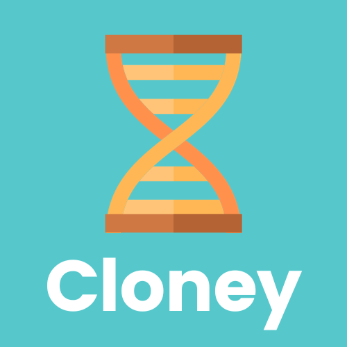

# Cloney

<br>
<p align="center">
  
</p>
<br>

## Introduction

Have you ever used a template Git repository and found yourself in the tedious task of replacing values manually or making extensive adjustments to fit your specific needs? If you have, you're not alone. Traditional Git templates often leave you with the burden of customizing every detail, which can be time-consuming and error-prone. This is where Cloney comes into play, revolutionizing the way you work with Git repositories.

### The Pain of Manual Adjustments

Imagine you've stumbled upon a fantastic template Git repository on GitHub that promises to kickstart your project. Excited, you fork the repository only to realize that it's not quite ready for your unique requirements. You need to replace placeholder values, tweak configurations, and adapt the code to match your project's specifications.

This process can be both frustrating and error-prone. Manually searching and replacing values throughout the codebase can lead to mistakes and inconsistencies. What if you could automate this entire customization process and have a template repository that adapts itself to your needs effortlessly? This is precisely what Cloney is designed to do.

### Cloney: Redefining Git Templates

Cloney is not just another Git template manager; it's a unique tool that redefines how you work with template repositories. With Cloney, you can say goodbye to manual adjustments and hello to dynamic template creation and management.

### Cloney Template Repositories

Cloney Template Repositories are the foundation of Cloney's innovative approach. These repositories are enriched with a special `.cloney.yaml` metadata file that contains vital information about the template repository.

### Custom Variables

Cloney empowers you to define variables within your templates. These variables act as placeholders for values that can be customized during the cloning process.

## What Makes a Cloney Template Repository?

A Cloney Template Repository consists of the following components:

- **Git Repository**: The core of your project, containing all the files, directories, and code that you want to share as a template.

- **`.cloney.yaml` Metadata File**: This special YAML file serves as the template repository's control center and is located in the root of the repository. It stores essential details about the repository, such as variable definitions, descriptions, and other crucial information that Cloney relies on to generate dynamic templates.

By adding the `.cloney.yaml` file to your repository's root, you effectively transform your standard repository into a Cloney Template Repository. This simple addition unlocks the power of dynamic template creation and customization, allowing users to tailor the project to their specific needs with ease.

## Understanding the `.cloney.yaml` Metadata File

To harness the full potential of Cloney Template Repositories, it's crucial to grasp the structure and content of the `.cloney.yaml` metadata file. This file serves as the blueprint for your template, defining its characteristics, variables, and default settings. Below is an illustrative example of a `.cloney.yaml` file:

```yaml
manifest_version: v1

name: Bank Site
description: A template to create a site for a bank.
authors:
  - Chico Buarque
  - Freddie Mercury
  - John Lennon
license: MIT
template_version: "1.1.0"

variables:
  - name: app_name
    description: The name of your application.
    default: my_app
    example: my_app

  - name: enable_https
    description: Wheter to enable HTTPS or not.
    example: true

  - name: currencies
    description: List of currencies to use.
    example:
      - Real
      - US Dollar
      - Yen
```

- **Manifest Version**: The version of the Cloney manifest file used in the template, ensuring compatibility with different versions of Cloney.

- **Name**: The name of your template, providing a clear identifier for users.

- **Description**: A brief but informative description of your template's purpose and functionality.

- **Authors**: A list of contributors or creators of the template, acknowledging their role in its development.

- **License**: The licensing information for your template, specifying how others can use and distribute it.

- **Template Version**: The version number of your template, allowing users to identify different releases.

- **Variables**: A list of variables that users can customize during the cloning process.

### Template Variables

Within the `.cloney.yaml` metadata file, Cloney allows you to define variables that users can customize during the cloning process. These variables play a central role in enabling dynamic template creation, ensuring that users can tailor templates to their specific requirements.

- **Name**: Assign a unique identifier to each variable, making it easy for users to reference and customize.

- **Description**: Provide a clear and concise description of each variable's purpose. These descriptions guide users in understanding how each variable affects the template.

- **Default (Optional)**: Specify a default value for each variable. This value is used when a user doesn't provide a custom value during the cloning process. If this field is omitted, Cloney assumes that the variable is mandatory and must be informed by the user.

- **Example Value**: Every variable must include an example value that demonstrates how it should be formatted and used. This example serves as a practical reference for users, helping them correctly configure variables within their customized templates.

## Customizing Variables

When cloning a Cloney Template Repository, users can customize variables by providing values that align with the variable definitions in the `.cloney.yaml` metadata file. Here's an example of a `.cloney-vars.yaml` file that contains custom values for the variables:

```yaml
app_name: My App
enable_https: true
currencies:
  - Real
  - US Dollar
  - Yen
```

## Accessing Variables in Template Files

Cloney makes it effortless to access and utilize variables within your template files. It employs the Go template syntax, a powerful and flexible language for generating text and code. It's essential to note that you **don't require any knowledge of Go programming** to utilize Cloney effectively. The term "Go template" is simply a historical reference to the language where these templates initially emerged.

To access and use variables within your template files, follow these steps:

1. **Enclose Variables with Double Curly Braces**: To indicate that a piece of text should be replaced with a variable's value, enclose the variable name within double curly braces. For example, `{{ .VariableName }}`.

2. **Use the Dot (`.`) to Access Variables**: In Go templates, you access variables by prefixing their names with a dot (`.`). This dot signifies the context in which the variable is defined.

**Example:**

Imagine you're working with a Cloney Template Repository for a billing system. In this template, you want to create a customized HTML file based on various parameters. Let's explore how Cloney's variables can make this process effortless.

Here's a snippet from your template HTML file, `index.html`:

```html
<!-- File: index.html -->

<h1>
  {{ .app_name }} is a fantastic app that supports the following currencies:
</h1>
<ul>
  {{- range .currencies }}
  <li>{{ . }}</li>
  {{- end }}
</ul>

{{- if .enable_https }}
<p>HTTPS is enabled.</p>
{{- end }}
```

Now, let's break down what's happening here:

- `{{ .app_name }}`: This placeholder will be replaced with the user-defined name of the application when you generate your customized template.

- `{{- range .currencies }} ... {{- end }}`: This construct iterates through the list of currencies provided by the user during the cloning process. It dynamically generates list items for each currency.

- `{{- if .enable_https }} ... {{- end }}`: This conditional block checks if the user has chosen to enable HTTPS during cloning. If so, it includes a paragraph indicating that HTTPS is enabled.

When you use Cloney to create your template based on user input, it automatically populates these placeholders with the values you specified during the cloning process. This results in a tailored HTML file that perfectly suits your requirements.

Here's an example of what the generated HTML could look like:

```html
<!-- File: index.html -->

<h1>MyApp is a fantastic app that supports the following currencies:</h1>
<ul>
  <li>Real</li>
  <li>US Dollar</li>
  <li>Yen</li>
</ul>

<p>HTTPS is enabled.</p>
```

### Go Template Tutorials

To help you make the most of Cloney's dynamic variables and the Go template syntax, we recommend exploring tutorials and documentation on Go templates. Go templates are a widely used tool for generating text and are well-documented within the Go programming language. You can find these resources at:

- **Official Go Documentation**: Dive into the official Go documentation for the `text/template` package, which provides an in-depth look at Go templates. Explore the intricacies of template creation and customization.

  - [Go Template Package Documentation](https://pkg.go.dev/text/template)

- **Go Text Templates**: Check out the official Go documentation dedicated to text templates. It offers comprehensive insights into working with Go templates, including advanced topics and best practices.

  - [Go Text Templates](https://golang.org/pkg/text/template/)

- **Sprig Functions**: Cloney leverages the Sprig library, which extends Go templates with a variety of useful functions. Familiarize yourself with these functions to enhance the capabilities of your Cloney templates and streamline your projects.

  - [Explore Sprig Functions](https://masterminds.github.io/sprig/)

## Cloney Command-Line Interface (CLI)

The Cloney Command-Line Interface (CLI) is the tool you use to interact with Cloney Template Repositories. It offers a set of straightforward commands that enable you to manage, customize, and work with Cloney templates.

Thank you for the clarification. Here's the updated information for the `cloney clone` command:

### Cloney CLI Commands

The `cloney` CLI is used to interact with Cloney Template Repositories, allowing you to clone, customize, and manage templates. Below, you'll find examples of various `cloney` commands:

1. **Start Command**

   - To create a new Cloney Template Repository in the current directory:

     ```bash
     cloney start
     ```

1. **Info Command**

   - To retrieve information about a Cloney Template Repository in the current directory:

     ```bash
     cloney info
     ```

   - To get information about a local Cloney Template Repository at a specific path:

     ```bash
     cloney info /path/to/local/repository
     ```

   - To fetch information about a remote Cloney Template Repository using its URL:

     ```bash
     cloney info https://github.com/username/template-repo.git
     ```

1. **Clone Command**

   - To clone a Cloney Template Repository with custom variable values from a variables file (e.g., `my-vars.yaml`) in the same directory:

     ```bash
     cloney clone https://github.com/username/template-repo.git -v my-vars.yaml
     ```

     If you don't specify a variables file using `-v`, Cloney will search for a file named `.cloney-vars.yaml` in the current directory by default.

     You can also specify variables using inline YAML:

     ```bash
     cloney clone https://github.com/username/template-repo.git -v '{ app_name: "MyApp", enable_https: true }'
     ```

1. **Dry Run Command**

   - To debug your own Cloney Template Repository, seeing how variables are replaced, and checking for errors:

     ```bash
     cloney dry-run -v my-vars.yaml
     ```

   Just like the `clone` command, you can pass variables in the same way.
