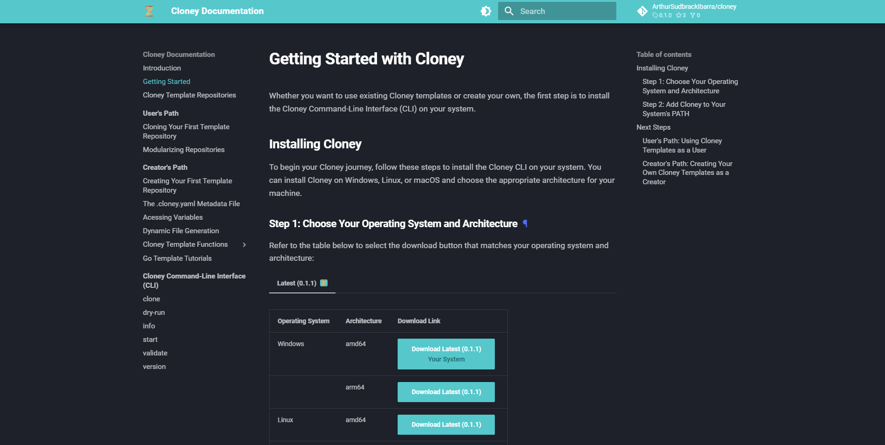

# Cloney: Dynamic Git Template Repositories

 

  

 

Have you ever used a template Git repository and found yourself in the tedious task of replacing values manually or making extensive adjustments to fit your specific needs? If you have, you're not alone. Traditional Git templates often leave you with the burden of customizing every detail, which can be time-consuming and error-prone. This is where Cloney comes into play, revolutionizing the way you work with Git repositories.

## The Pain of Manual Adjustments

Imagine you've stumbled upon a fantastic template Git repository on GitHub that promises to kickstart your project. Excited, you fork the repository only to realize that it's not quite ready for your unique requirements. You need to replace placeholder values, tweak configurations, and adapt the code to match your project's specifications.

This process can be both frustrating and error-prone. Manually searching and replacing values throughout the codebase can lead to mistakes and inconsistencies. What if you could automate this entire customization process and have a template repository that adapts itself to your needs effortlessly? This is precisely what Cloney is designed to do, with it, you can say goodbye to manual adjustments and hello to dynamic template creation and management.

## Official Cloney Documentation

For comprehensive and detailed information about Cloney and how to make the most of its features, please visit the [Official Cloney Documentation](https://arthursudbrackibarra.github.io/cloney-documentation/). This documentation provides step-by-step guides, tutorials, and in-depth explanations to help you master Cloney and streamline the creation of dynamic Git template repositories.

 

  

